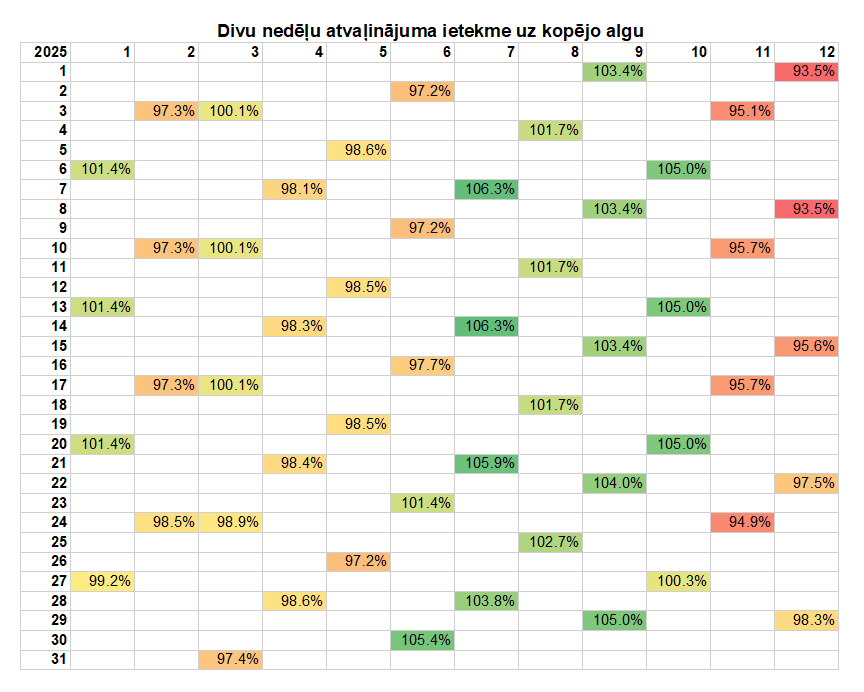
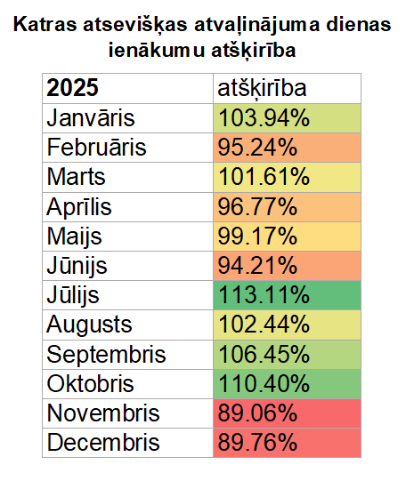

# Vacation Calculator for Latvia
Calculator for vacation impact on salary based on the date when starting vacation. Valid for Latvia only.

Creates:

* a `vacation_[year]_hourly.CSV` file that contains a table of vacation's impact on salary overall monthly salary. By default only Mondays are shown when a 2-week vacation starts.

* a `vacation_[year]_daily_simple.CSV` file that contains a simple table of daily salary difference for a given month.

Use `vacation_template.xlsx` to pretty-print the results' heat map. Example:

